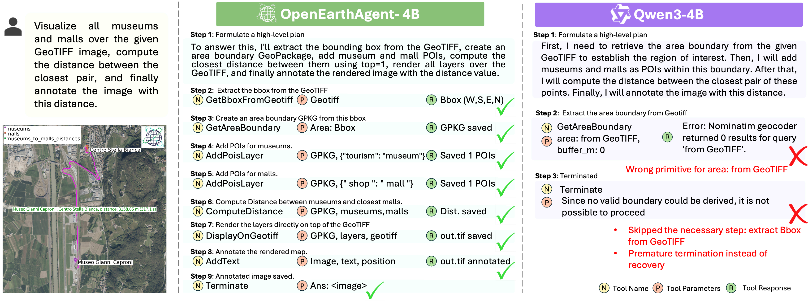
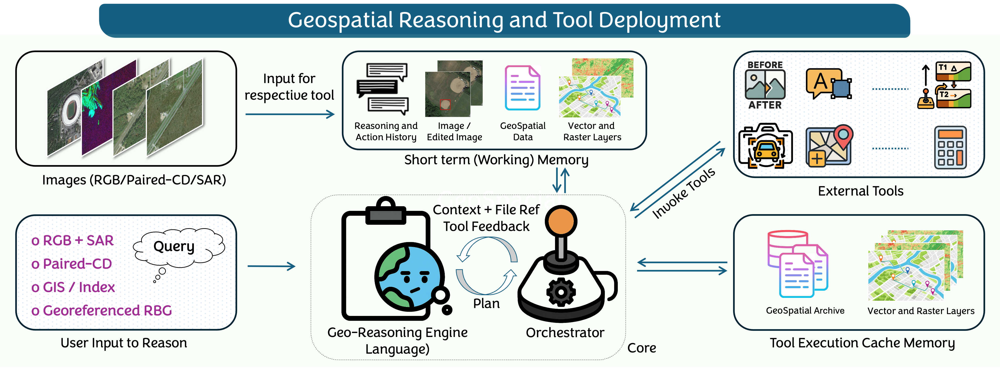
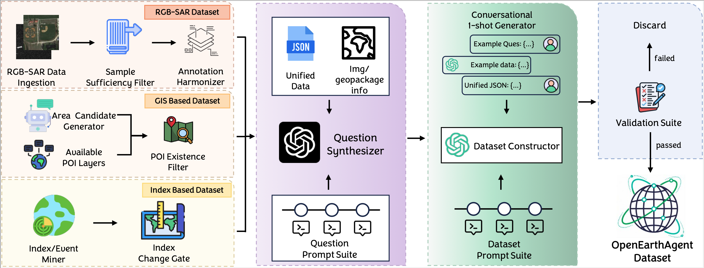

<div align="center">
  
  <h1 align="center">A Unified Framework for Tool-Augmented Geospatial Agents</h1>
</div>


<div  align="center" style="margin-top:10px;"> 
  
[Akashah Shabbir](https://github.com/AkashahS)\*, [Muhammad Umer Sheikh]()\*, [Muhammad Akhtar Munir](),[Hiyam Debary](),[Mustansar Fiaz](),[Muhammad Zaigham Zaheer](), [Paolo Fraccaro](), [Fahad Shahbaz Khan](), [Muhammad Haris Khan](), [Xiao Xiang Zhu]() , [Salman Khan]()

**Mohamed bin Zayed University of Artificial Intelligence, IBM Research, Linköping University, Australian National University**

[](https://mbzuai-oryx.github.io/OpenEarthAgent/)
[](https://arxiv.org/abs/2602.17665)
[](https://huggingface.co/MBZUAI/OpenEarthAgent)


<em> <sup> *Equal Contribution  </sup> </em>
<br>

</div>

OpenEarthAgent is a unified framework for building tool-augmented geospatial agents capable of structured, multi-step reasoning over satellite imagery and GIS data. Designed for remote sensing applications, it integrates multispectral analysis, geospatial operations, and natural-language understanding to enable interpretable, tool-driven decision making. The accompanying dataset contains 14,538 training and 1,169 evaluation instances,
with more than 100K reasoning steps in the training split and over 7K reasoning steps in the evaluation split. It covers diverse domains including urban analysis, environmental monitoring, disaster response, and infrastructure assessment, and integrates GIS-based operations with index computations such as NDVI, NBR, and NDBI.
<div align="center">
  
  <br>
  <em>OpenEarthAgent-4B’s geospatial reasoning capabilities compared to the baseline Qwen3-4B Model </em>
</div>

---

## 📢  Latest Updates
- **Feb-20-2025** OpenEarthAgent demo coming soon!
- **Feb-20-2025** OpenEarthAgent codebase is released along with evaluation and training scripts. 
- **Feb-20-2025**: 📂 OpenEarthAgent model is released on **_HuggingFace_** [MBZUAI/OpenEarthAgent](https://huggingface.co/MBZUAI/OpenEarthAgent)
- **Feb-20-2025**: 📜 Technical Report of OpenEarthAgent paper is released [arxiv link](https://arxiv.org/abs/2602.17665).

---

## 🛠️ Architecture

OpenEarthAgent is a tool-augmented geospatial reasoning framework built on a large language model backbone. The agent decomposes tasks into multi-step trajectories that interleave reasoning and executable tool calls. A unified tool registry standardizes perceptual (e.g., detection, segmentation), GIS (e.g., distance, area, zonal statistics), spectral (e.g., NDVI, NBR, NDBI), and GeoTIFF-based operations under a structured JSON schema. A central orchestrator validates arguments, executes tools, caches intermediate outputs, and appends observations to the working memory, enabling spatially grounded, interpretable reasoning across multimodal EO inputs (RGB, SAR, GIS layers, indices).

<div align="center">
  
  <br>
  <em>Overview of the OpenEarthAgent Geospacial Reasoning and Tool Deployment Pipeline.</em>
</div>

---

## 🏷️ Annotation Pipeline

The pipeline consists of (1) automated dataset curation, (2) supervised reasoning alignment, and (3) structured evaluation. The dataset integrates optical, SAR, GIS, and multispectral sources into a unified JSON schema containing queries, multimodal inputs, and validated reasoning traces (14,538 train / 1,169 test). Each trajectory is replay-verified to ensure geometric validity and tool correctness. The model is trained via supervised fine-tuning on multi-step tool trajectories, optimizing only tool-action prediction while masking environment outputs. Evaluation is performed in both step-by-step (tool-agnostic reasoning validation) and end-to-end (live tool execution) modes to assess tool selection, argument correctness, trajectory fidelity, and final task accuracy.

<div align="center">
  
  <br>
  <em>Unified data-curation pipeline for OpenEarthAgent Dataset</em>
</div>

---

## 🚀 Quick Start

The framework is built around two primary modules: the `tool server`, which provides essential tool-based services, and `TF-EVAL`, the module responsible for inference and evaluation. Each module has distinct environment dependencies. The tool server must be successfully launched before executing any inference or training processes.

### Launch Tool Server
You can launch the `tool_server` locally.

### 🛠️ Installation
It requires separate environments for different tool groups to avoid dependency conflicts.
### 1️⃣ Core Tool Server Environment (E1)
```bash
# Create a clean Conda environment
conda create -n tool-server-e1 python=3.10
conda activate tool-server-e1
# Install PyTorch and dependencies (make sure CUDA version matches)
pip install torch==2.5.1 torchvision==0.20.1 torchaudio==2.5.1 --index-url https://download.pytorch.org/whl/cu121

# Install this project
git clone https://github.com/mbzuai-oryx/OpenEarthAgent.git
cd OpenEarthAgent

# Install tool dependencies (SAM2 and Grounding Dino.) and download checkpoint
mkdir models
cd models
pip install -e git+https://github.com/facebookresearch/sam2.git#egg=sam-2
cd src/sam-2/checkpoints
sh download_ckpts.sh
cd ../../..

# please make sure the environment variable CUDA_HOME is set, (export CUDA_HOME=/usr/local/cuda-12.1)
git clone https://github.com/IDEA-Research/GroundingDINO.git
cd GroundingDINO/
pip install -e . --no-build-isolation
cd ..
wget -q https://github.com/IDEA-Research/GroundingDINO/releases/download/v0.1.0-alpha/groundingdino_swint_ogc.pth

# Install project requirements
cd ..
conda install -c conda-forge qgis -y 
pip install -r ./requirements/tool_server_e1_requirements.txt 
pip install -e .
```

### 2️⃣ Change Detection Environment (E2)
This environment isolates change detection dependencies.

```bash
#create seperate environment for ChangeDetection tool
conda create -n tool-server-e2 python=3.10
conda activate tool-server-e2

# Install PyTorch and dependencies (make sure CUDA version matches)
pip install torch==2.1.0 torchvision==0.16.0 torchaudio==2.1.0 --index-url https://download.pytorch.org/whl/cu121
pip install -r ./requirements/tool_server_e2_requirements.txt 
pip install -e .
```

### 3️⃣ Object Detection Environment (E3)

This environment supports LAE-DINO-based object detection tools.

```bash
#create seperate environment for ObjectDetection tools
conda create -n tool-server-e3 python=3.10
conda activate tool-server-e3

# Install PyTorch and dependencies (make sure CUDA version matches)
pip install torch==2.5.1 torchvision==0.20.1 torchaudio==2.5.1 --index-url https://download.pytorch.org/whl/cu121
pip install --extra-index-url https://miropsota.github.io/torch_packages_builder mmcv==2.2.0+pt2.5.1cu121

# Install tool dependencies (LAE-DINO)
cd models
git clone https://github.com/jaychempan/LAE-DINO
cd LAE-DINO/mmdetection_lae
pip install -e .  --no-build-isolation
cd ../..
gdown https://drive.google.com/uc?id=1EiR8KtNRYIeOfvtIe9C82cQk_uOMIQ8U
cd ..
pip install -r ./requirements/tool_server_e3_requirements.txt 
pip install -e .

#create seperate environment for ChangeDetection tool

```

⚠️ Note:

This project intentionally uses a lightweight dependency setup to minimize potential version conflicts. Depending on your system configuration, you may need to install additional packages manually if any required components are missing.

#### Start Tool Server Locally

### Step 1: Update Configuration
Before launching the server, update the configuration file to match your local environment (base paths, model paths, CUDA devices, conda environments, etc.):

[`tool_server/tool_workers/scripts/launch_scripts/config/all_service_example_local.yaml`](tool_server/tool_workers/scripts/launch_scripts/config/all_service_example_local.yaml)

For detailed instructions on configuring tools refer to:
- [Configure Tools](docs/tools_guide/configure_tools.md)

```bash
## Start all services
conda activate tool-server-e1
cd tool_server/tool_workers/scripts/launch_scripts
python start_server_local.py --config ./config/all_service_example_local.yaml

## Press Ctrl + C to shutdown all services automatically.
```

Examine the log files to ensure the tools are properly configured and to diagnose any potential issues. 
For tool checking, debugging and some common issues refer to:
- [Tool Server Guide](docs/tools_guide/tools_server_guide.md)

Additionally, you can execute tools_test to verify that all tools are functioning properly.

```bash
conda activate tool-server-e1
python scripts/tools_test/tools_test.py 
```

### 🔍 Step 2: Run Quick Inference with OpenEarthAgent

This section guides you through setting up the environment and running a quick inference/demo using OpenEarthAgent.

### 🛠️ Installation
We recommend using a clean Conda environment to avoid dependency conflicts.

```bash
# Create a clean Conda environment
conda create -n OEA-env python=3.10
conda activate OEA-env
# Install PyTorch and dependencies (make sure CUDA version matches)
pip install torch==2.5.1 torchvision==0.20.1 torchaudio==2.5.1 --index-url https://download.pytorch.org/whl/cu121

# Install this project
pip install -e .
pip install -r requirements/inference_requirements.txt 
```
### 🚀 Running Inference
Option 1: Quick Chat Inference (CLI)
Run the chat-based inference script:
```bash
python scripts/chat/chat.py
```
This launches a lightweight command-line interface for interacting with the agent.

Option 2: Interactive Web Demo (Gradio)
Start the Gradio application:
```bash
python app/app.py
```
This will launch a local web interface for interactive experimentation.

### 📂 Data

The dataset is organized under the following directory structure:

```
OpenEarthAgent/
└── data/
    ├── train.json
    ├── test.json
    ├── train_image/
    └── test_image/
    └── gpkgs/
```

- train.json – Training split containing conversational samples with tool-planning annotations.
- test.json – Evaluation split used for step-by-step and end-to-end assessment.
- train_image/ – Images associated with training samples.
- test_image/ – Images used during evaluation.
- gpkgs/ - Cached Geopackages for evalation

Each JSON file stores structured conversation data that is converted into a chat format during training. Image folders contain the corresponding visual inputs referenced by the dataset entries.

Ensure the data/ directory is correctly configured before launching evaluation or training scripts.

### 📊 Evaluation
You can evaluate the model using either end-to-end or step-by-step evaluation modes.
🔹 End-to-End Evaluation

End-to-end evaluation tests full autonomous execution with live tool use: the model issues tool calls, forms arguments, and reasons iteratively based on tool outputs. This setting measures robustness, argument correctness, and perception–action integration. Run with
```
sh scripts/eval/eval_e2e.sh
```

🔹 Step-by-Step Evaluation

Step-by-step evaluation measures procedural reasoning without executing tools: the model generates valid actions over n steps using the full interaction history, with the first step exempt to allow high-level planning. This setting isolates reasoning quality, plan coherence, and geospatial understanding. Run with
```
sh scripts/eval/eval_step.sh
```
### 🚀 Training

We provide a Supervised Fine-Tuning (SFT) pipeline to train the model for structured planning, reasoning, and tool invocation. Training is performed with Unsloth using full fine-tuning on a chat-formatted dataset.

## 🔧 Environment Setup
```bash
# Create a clean Conda environment
conda create -n OEA-train-env python=3.10
conda activate OEA-train-env
# Install PyTorch and dependencies (make sure CUDA version matches)
pip install torch==2.5.1 torchvision==0.20.1 torchaudio==2.5.1 --index-url https://download.pytorch.org/whl/cu121

# Install this project
pip install -e .
pip install -r requirements/train_requirements.txt 
```

## ▶️ Launch Training
```
sh scripts/train/train.sh
```
The training script supports distributed execution and saves checkpoints to the specified output directory.
## 📖 Citation

Please cite the following if you find OpenEarthAgent helpful:

---

[](https://www.ival-mbzuai.com)
[](https://github.com/mbzuai-oryx)
[](https://mbzuai.ac.ae)


